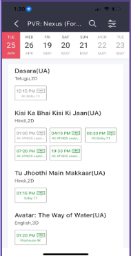

# 🎬 BookMyShow Ticketing Platform (Database Assignment)

This project models a simplified **BookMyShow-like system** for booking movie tickets.  
It includes **entities, normalized table structures, SQL schema, sample data, and queries**.

---

## 📌 Problem Statement
- A user can select a **theatre** and view the **next 7 dates**.  
- On selecting a date, the system shows **all movies running in that theatre** with their **show timings**.

---

## 📝 Requirements

### P1: Database Design
- Identify all **entities** and their **attributes**.
- Create **normalized tables** (1NF → BCNF).
- Write **SQL `CREATE TABLE` scripts**.
- Insert **sample data** (cities, theatres, movies, showtimes, etc.).

### P2: Query Requirement
- Write a query to **list all shows** on a **given date** at a **given theatre**, including their **show timings**.

---

## 📊 Entities & Attributes

1. **City**
   - `city_id`, `name`, `state`, `country`  

2. **Theatre**
   - `theatre_id`, `name`, `address_line`, `city_id (FK)`  

3. **Auditorium (Screen)**
   - `auditorium_id`, `theatre_id (FK)`, `name`, `capacity`  

4. **Movie**
   - `movie_id`, `title`, `duration_min`, `certificate`, `language`, `format`, `release_date`  

5. **SeatType**
   - `seat_type_id`, `name` (Regular, Premium, Recliner)  

6. **Seat**
   - `seat_id`, `auditorium_id (FK)`, `row_label`, `seat_number`, `seat_type_id (FK)`  

7. **Showtime**
   - `show_id`, `movie_id (FK)`, `auditorium_id (FK)`, `show_date`, `start_time`, `end_time`, `base_price`  

---

## 🛠️ SQL Schema

See full SQL script in [`BookMyShow.sql`](BookMyShow.sql).

Example snippet:

```sql
CREATE TABLE movie (
  movie_id BIGINT PRIMARY KEY AUTO_INCREMENT,
  title VARCHAR(200) NOT NULL,
  duration_min INT NOT NULL,
  certificate VARCHAR(10),
  language VARCHAR(50),
  format VARCHAR(50),
  release_date DATE
);
```

---

## 🔍 Query Example (P2)

```sql
SELECT m.title,
       s.show_date,
       s.start_time,
       s.end_time,
       a.name AS screen,
       t.name AS theatre
FROM showtime s
JOIN movie m       ON s.movie_id = m.movie_id
JOIN auditorium a  ON s.auditorium_id = a.auditorium_id
JOIN theatre t     ON a.theatre_id = t.theatre_id
WHERE s.show_date = '2023-04-25'
  AND t.name = 'PVR Nexus Forum'
ORDER BY s.start_time;
```

---

## 📸 Demo Screenshot

Below is a demo screenshot representing the UI:



---

## ✅ Submission Checklist
- [x] Entities & Attributes listed  
- [x] Tables normalized (1NF, 2NF, 3NF, BCNF)  
- [x] SQL scripts written  
- [x] Sample data inserted  
- [x] Query written for P2  
- [x] Demo screenshot added  

---

## 📂 Files in Repo
- `README.md` → Documentation  
- `BookMyShow.sql` → SQL table definitions + inserts  
- `project1.png` → Demo screenshot  

---

👨‍💻 *Assignment prepared for MySQL database, directly executable.*
